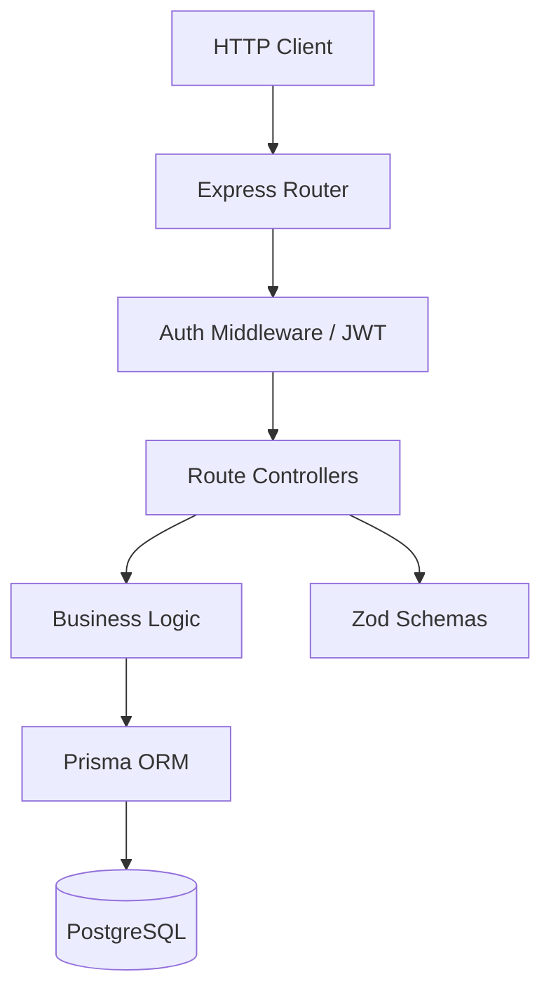

<div align="center">
  
</div>

<h1 align="center">Express + TypeScript + Prisma REST API Starter</h1>

<div align="center">
  <p><strong>A production-grade REST API boilerplate with JWT authentication, input validation, Prisma ORM, comprehensive error handling, and full test coverage.</strong></p>
  
  <p>
    
    
  </p>
</div>

---

## ⚡ What's Included

This is not a tutorial project — it's a **production-ready starter** designed for immediate use in real applications.

| Layer | Technology | Purpose |
|-------|-----------|---------|
| **Runtime** | Node.js + Express | HTTP server |
| **Language** | TypeScript (Strict Mode) | Type safety |
| **ORM** | Prisma | Database access with migrations |
| **Auth** | JWT + bcrypt | Stateless authentication |
| **Validation** | Zod | Runtime input validation |
| **Testing** | Jest + Supertest | Unit + integration tests |
| **CI/CD** | GitHub Actions | Automated build + test |

---

## 🏗️ Architecture



---

## 🚀 Quick Start

```bash
git clone https://github.com/tapiwamakandigona/express-api-starter.git
cd express-api-starter
npm install
cp .env.example .env
npx prisma migrate dev
npm run dev
```

## 🧪 Run Tests

```bash
npm test
```

---

<div align="center">
  <b>Built by <a href="https://github.com/tapiwamakandigona">Tapiwa Makandigona</a></b>
  <br/>
  <i>⭐ Star this if you use it as a starter for your next API!</i>
</div>
