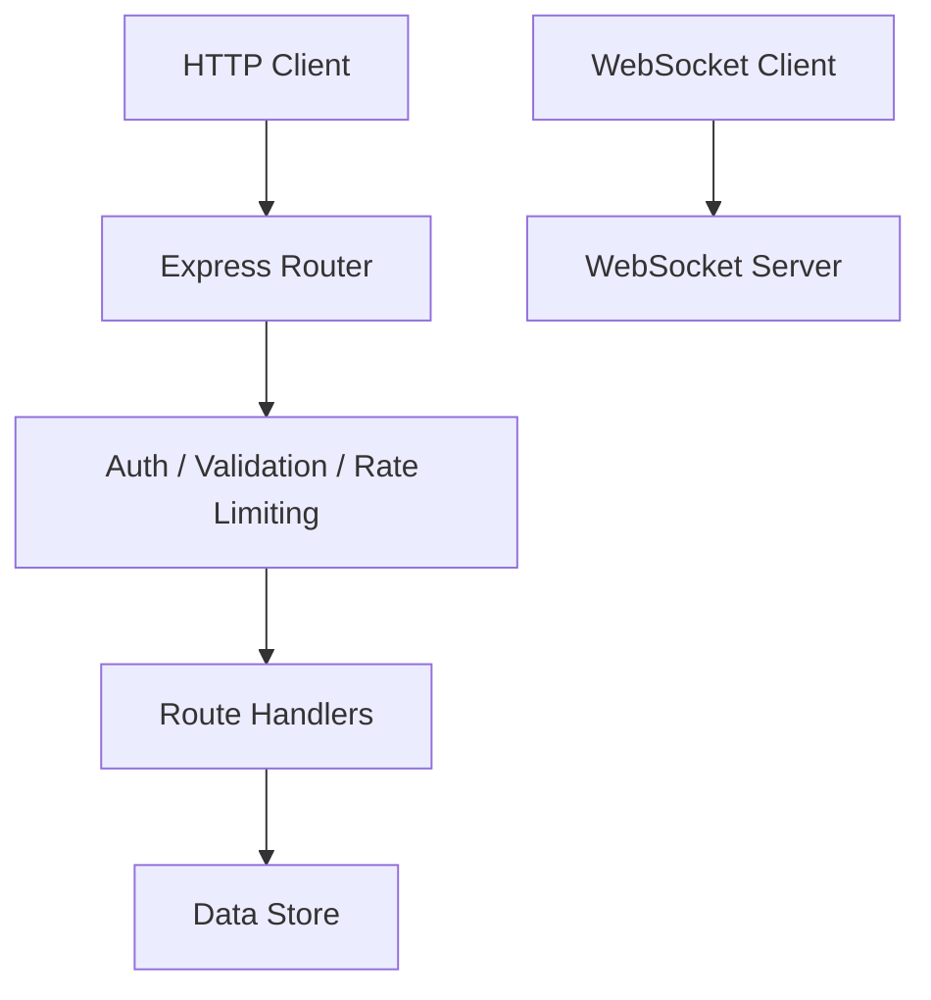

<div align="center">
  
</div>

<h1 align="center">Express + TypeScript REST API Starter</h1>

<div align="center">
  <p><strong>A production-grade REST API boilerplate with JWT authentication, input validation, comprehensive error handling, and tests.</strong></p>
  
  <p>
    
    
    
  </p>
</div>

---

## ⚡ What's Included

This is not a tutorial project — it's a **production-ready starter** designed for immediate use in real applications.

| Layer | Technology | Purpose |
|-------|-----------|---------|
| **Runtime** | Node.js + Express | HTTP server |
| **Language** | TypeScript (Strict Mode) | Type safety |
| **Auth** | JWT + bcrypt | Stateless authentication |
| **Validation** | Custom middleware | Runtime input validation |
| **Real-time** | WebSocket (ws) | WebSocket support with rooms |
| **Security** | Helmet + CORS + Rate Limiting | HTTP hardening |
| **Testing** | Jest + Supertest | Unit + integration tests |
| **CI/CD** | GitHub Actions | Automated build + test |
| **Containerization** | Docker + Docker Compose | Production deployment |

---

## 🏗️ Architecture


```mermaid
graph TD;
    Client[HTTP Client] --> Router[Express Router];
    Router --> Middleware[Auth / Validation / Rate Limiting];
    Middleware --> Routes[Route Handlers];
    Routes --> Store[Data Store];
    WS[WebSocket Client] --> WSS[WebSocket Server];
```

> **Note:** The starter uses in-memory data storage by default. Swap in your preferred database (Prisma, TypeORM, Mongoose, etc.) for production use.

---

## 🚀 Quick Start

```bash
git clone https://github.com/tapiwamakandigona/express-api-starter.git
cd express-api-starter
npm install
cp .env.example .env    # Edit .env with your settings
npm run dev             # Start dev server with hot reload
```

The server will start at `http://localhost:3000`.

## 📜 Available Scripts

| Command | Description |
|---------|-------------|
| `npm run dev` | Start dev server with hot reload (tsx) |
| `npm run build` | Compile TypeScript to `dist/` |
| `npm start` | Run compiled production build |
| `npm test` | Run test suite with Jest |

## 🧪 Run Tests

```bash
npm test
```

## 🐳 Docker

```bash
# Build and run with Docker Compose
docker-compose up --build

# Or build manually
docker build -t express-api-starter .
docker run -p 3000:3000 express-api-starter
```

---

## 📁 Project Structure

```
src/
├── __tests__/              # Test files
│   ├── auth.test.ts        # JWT token tests
│   ├── health.test.ts      # Health + auth integration tests
│   └── middleware.test.ts   # Validation middleware tests
├── middleware/
│   ├── auth.ts             # JWT authentication & token generation
│   ├── cache.ts            # In-memory response caching with ETags
│   ├── cors.ts             # Custom CORS middleware
│   ├── errorHandler.ts     # Centralized error handling (AppError)
│   ├── paginate.ts         # Pagination middleware & helpers
│   ├── rateLimiter.ts      # Fixed-window rate limiter
│   ├── requestLogger.ts    # Request/response logging with timing
│   ├── slidingWindowRateLimiter.ts  # Sliding-window rate limiter
│   └── validate.ts         # Request body validation middleware
├── routes/
│   ├── auth.ts             # Register & login endpoints
│   ├── health.ts           # Health check endpoint
│   └── users.ts            # Protected user endpoints
├── utils/
│   └── retry.ts            # Retry with backoff & circuit breaker
├── websocket.ts            # WebSocket server (rooms, broadcast)
└── index.ts                # App setup & server entry point
```

## 🔌 API Endpoints

| Method | Endpoint | Auth | Description |
|--------|----------|------|-------------|
| `GET` | `/api/health` | No | Health check |
| `POST` | `/api/auth/register` | No | Register a new user |
| `POST` | `/api/auth/login` | No | Login & get JWT |
| `GET` | `/api/users/me` | Yes | Get current user |

Full API documentation is available in [`docs/openapi.yml`](docs/openapi.yml).

## ⚙️ Environment Variables

| Variable | Default | Description |
|----------|---------|-------------|
| `PORT` | `3000` | Server port |
| `JWT_SECRET` | `change-me-in-production` | JWT signing secret |
| `CORS_ORIGIN` | `*` | Allowed CORS origin |

---

## 📄 License

[MIT](LICENSE)

---

<div align="center">
  <b>Built by <a href="https://github.com/tapiwamakandigona">Tapiwa Makandigona</a></b>
  <br/>
  <i>⭐ Star this if you use it as a starter for your next API!</i>
</div>
